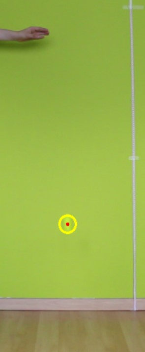

# DDE_project_bouncingball 🥎

## Screenshot

  

## Features

## Deployment

## Author

- [@Louise Massager](https://github.com/LouiseMassager)
- [@Dinh-Hao Nguyen](https://github.com/Dinh-Hao-Nguyen)
- [@Yiming]
- [@Mohammadjavad Rahim]

## Acknowledgements

- [opencv to track ball with color](https://stackoverflow.com/questions/63730808/golf-ball-tracking-in-python-opencv-with-different-color-balls).
- [opencv to track ball with shape](https://www.youtube.com/watch?v=RaCwLrKuS1w&ab_channel=CodeSavant).
